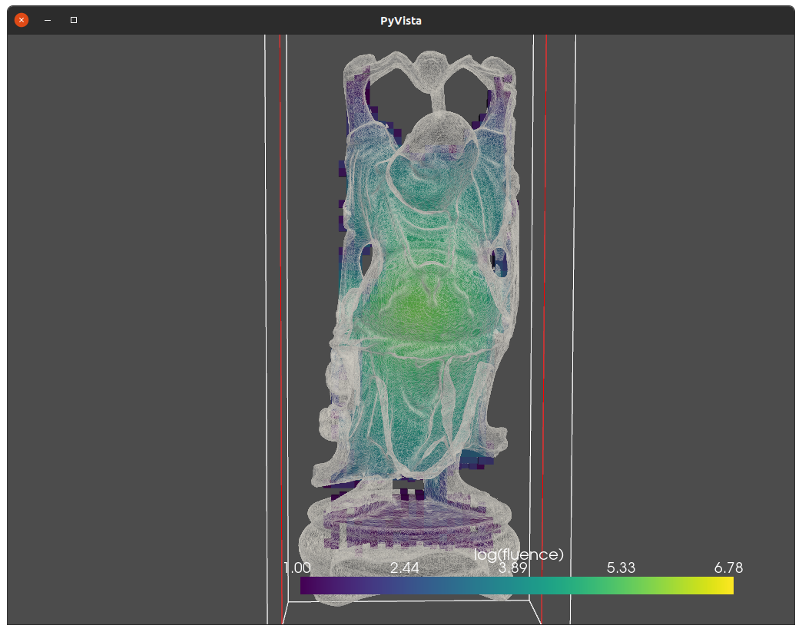
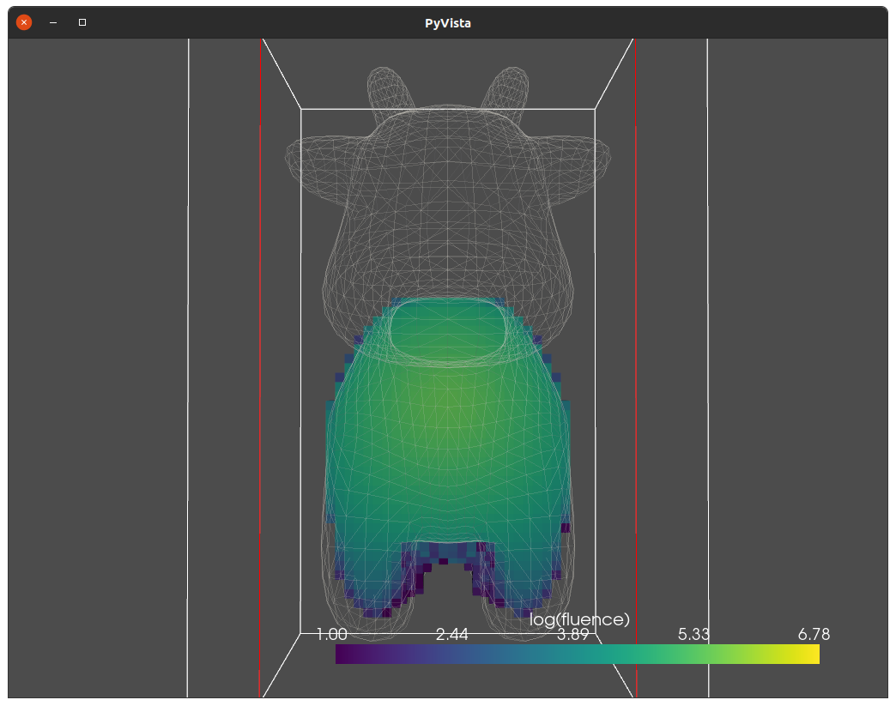
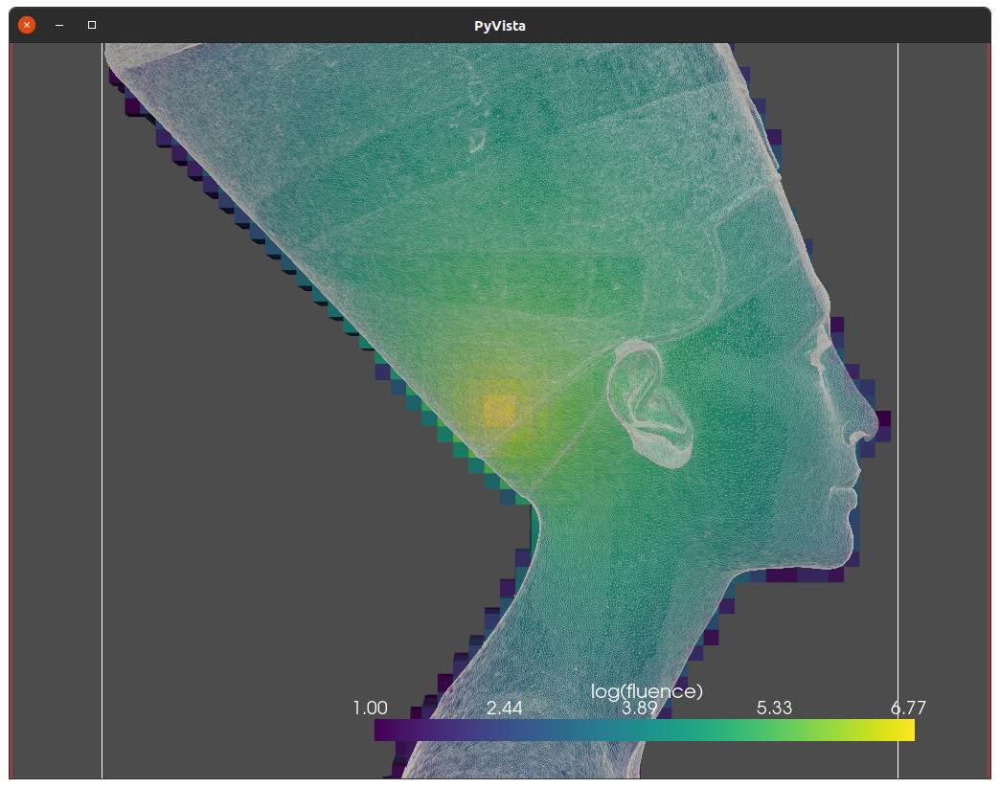

# oMCRT - Optix Monte Carlo Radiation Transfer.

Monte Carlo code in c++/CUDA that utilises Optix to enable GPU computation of nearest intersection.

Currently the code is setup with an isotropic source at the origin.
The photon packets then traverse a mesh of triangles and upon exit of the mesh are killed off.
The medium has an albedo of unity and scattering coefficient of $10cm^{-1}$.

Optix scaffolding code is based upon Ingo Wald's [Optix 7 course](https://github.com/ingowald/optix7course) in particular example's 4 and 7.
Actual MCRT code is contained in simulationPrograms.cu

Code also contains a basic renderer for viewing the meshes. Renderer shows the mesh with a solid colour and wireframe.

## Performance

  * [Spot model](https://www.cs.cmu.edu/~kmcrane/Projects/ModelRepository/): ~350 MPhotons/s
  * [Nefertiti Bust](https://www.cs.cmu.edu/~kmcrane/Projects/ModelRepository/): ~ 160 Mphotons/s
  * [Standford Bunny](https://casual-effects.com/data/): ~220 MPhotons/s
  * [Happy Buddha](https://casual-effects.com/data/): ~240 MPhotons/s

## Screenshots
  #### Buddha model
  
  #### Spot model
  
  #### Nefertiti bust
  

## Dependencies
  * c++ compiler
  * Nvidia hpc SDK
  * Optix
  * tiny_obj_loader (included)
  * GDT (included)

## Todo
  - [x] Add absoprtion/photon weighting
  - [x] Add HG Phase function
  - [ ] Test current code.
  - [ ] Add per mesh optical properties
  - [ ] Add reflections/refractions
  - [ ] Add SDFs
  - [ ] Add wavelength variable optical properties
